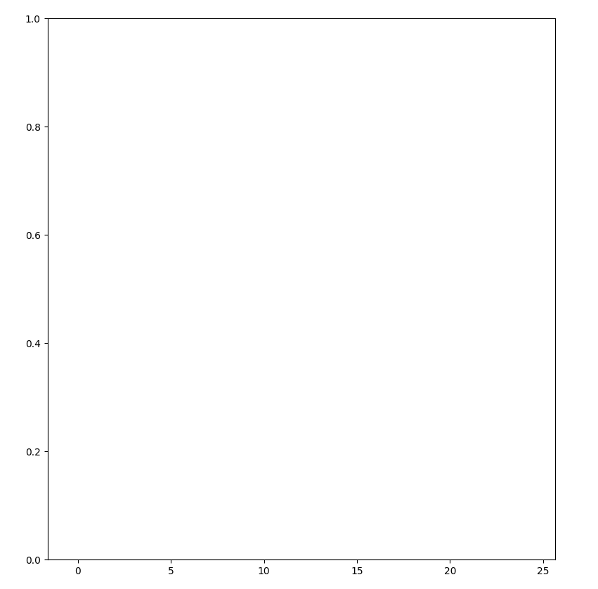

# **[Week 2 Assignment] : Markov Localization**

------

### Implementation

- motion_model( )

  - For each possible prior positions, calculate the probability that the vehicle will move to the position specified by `position` given as input.
  - 구현 내용 :

  ```python
  def motion_model(position, mov, priors, map_size, stdev):
  	position_prob = 0.0
    mu = mov
  
    probs = []
    for i in range(map_size):
        p_trans = norm_pdf(position - i, mov, stdev)
        p_prior = priors[i]
        p = p_trans * p_prior
        probs.append(p)
  
    position_prob = sum(probs)
    return position_prob
  ```

  - 각 timestamp 마다, $p_{x_t}$

    ```python
    probs = []
    for i in range(map_size):
    	p_trans = norm_pdf(position - i, mov, stdev)
      p_prior = priors[i]
      p = p_trans * p_prior
      probs.append(p)
    ```

    - $ p_{trans} $ : normal distribution

    - $ p_{prior} $ : 직전 위치

    - $ p_{trans} $ 와 $ p_{prior} $ 를 각각 계산하고 곱해서 probs list에 담아 모두 합함

      - $ \sum_{i} p(x_t | x_{t-1}^{(i)}, u_t) bel(x_{t-1}^{(i)}) $

        

- observation_model( )

  - Given the `observations`, calculate the probability of this measurement being observed using `pseudo_ranges`.
  - 구현 내용 :

  ```python
  def observation_model(landmarks, observations, pseudo_ranges, stdev):
      distance_prob = 1.0
      
      if len(observations) == 0 or len(observations) > len(pseudo_ranges):
          distance_prob = 0.0
      else:
          for i in range(len(observations)):
              x_t = observations[i]
              mu = pseudo_ranges[i]
              p = norm_pdf(x_t, mu, stdev)
              distance_prob *= p
  
      return distance_prob
  ```

  - 조건사항 :

    - If we have no observations, we do not have any probability.

    - Having more observations than the pseudo range indicates that this observation is not possible at all.

      ```python
      if len(observations) == 0 or len(observations) > len(pseudo_ranges):
        distance_prob = 0.0
      ```

  - 위의 조건을 통과한 경우, normal distribution 을 따르는 probability 계산

    - the probability of this "observation" is the product of probability of observing each landmark at that distance, where that probability follows N(d, mu, sig) with

      ​	d: observation distance 

      ​	mu: expected mean distance, given by pseudo_ranges 

      ​	sig: squared standard deviation of measurement

      ```python
      else:
        for i in range(len(observations)):
          x_t = observations[i]
          mu = pseudo_ranges[i]
          p = norm_pdf(x_t, mu, stdev)
          distance_prob *= p
      ```

### 실행 결과

