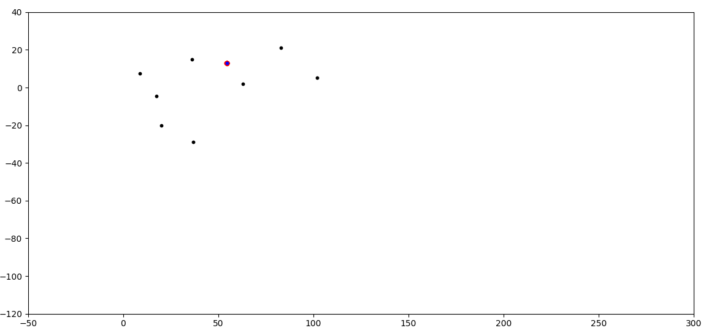

# **[Week 4 Assignment] : Motion Model & Particle Filters**

------

### Implementation

- update_weights( )

    - For each particle in the sample set, calculate the probability of the set of observations based on a multi-variate Gaussian distribution.
    - 구현 내용 :

        - 1. Select the set of landmarks that are visible (within the sensor range).
            - particle 의 x, y 좌표와 landmark 의 x, y 좌표의 distance를 구하고 sensor range의 범위를 visible landmark 선택

        ```python
        predicted_landmarks = []    
        for landmark_id in map_landmarks:
            if distance(particle, map_landmarks[landmark_id]) < sensor_range:
                predicted_landmarks.append({'id': landmark_id,
                                            'x': map_landmarks[landmark_id]['x'],
                                            'y': map_landmarks[landmark_id]['y']})
        ```

        - 2. Transform each observed landmark's coordinates from the particle's coordinate system to the map's coordinates.

        ```python
        transformed_obs = []
        for obs in observations:
            transformed_x = particle['x'] + math.cos(particle['t']) * obs['x'] - math.sin(particle['t']) * obs['y']
            transformed_y = particle['y'] + math.sin(particle['t']) * obs['x'] + math.cos(particle['t']) * obs['y']

            transformed_obs.append({'x': transformed_x,
                                    'y': transformed_y})
        ```

        - 3. . Associate each transformed observation to one of the predicted (selected in Step 1) landmark positions.   
        Use self.associate() for this purpose - it receives the predicted landmarks and observations; and returns   
        the list of landmarks by implementing the nearest-neighbour association algorithm.

        ```python
        associations = self.associate(predicted_landmarks, transformed_obs)
        ```

        - 4. Calculate probability of this set of observations based on a multi-variate Gaussian distribution (two variables being   
        the x and y positions with means from associated positions and variances from std_landmark_x and std_landmark_y).   
        The resulting probability is the product of probabilities for all the observations.   
            - Multi-variate Gaussian distribution 을 이용해 weight 계산

        ```python
        for i in range(len(associations)):
            transformed_x = transformed_obs[i]['x']
            transformed_y = transformed_obs[i]['y']

            assoc_x = associations[i]['x']
            assoc_y = associations[i]['y']

            weight *= multi_gaussian_distribution(transformed_x, transformed_y,
                                                    assoc_x, assoc_y,
                                                    std_landmark_x, std_landmark_y) + 1e-60
        ```

        - 5. Update the particle's weight by the calculated probability.

        ```python
        particle['w'] = weight
        ```

### 실행 결과



