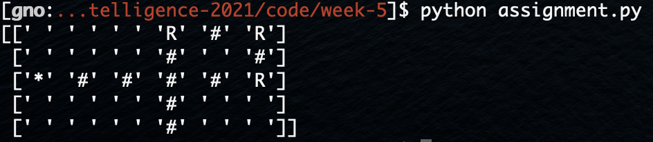

# **[Week 5 Assignment] : Path Planning & the A* Algorithm

------

### Implementation

- Extend `policy.py` in two aspects:
    - State space: since we now consider not only the position of the vehicle but also its orientation, the state is now represented in 3D instead of 2D.
    - Cost function: we define different cost for different actions. They are:
        - Turn right and move forward
        - Move forward
        - Turn left and move forward

    - 구현 내용 :
        1. Mark the final state with a special value that we will use in generating the final path policy.
        ```python
        if (y, x) == goal and value[(t, y, x)] > 0:
            # TODO: implement code.
            policy[(t, y, x)] = -999
            value[(t, y, x)] = 0
            change = True
        ```
        - for 문에서 value가 유효한 값이고 (y, x) 가 목적지인 경우에 대한 설정   
        2. Try to use simple arithmetic to capture state transitions.
        ```python
        elif grid[(y, x)] == 0:
            # TODO: implement code.
            for i in range(len(action)):
                act = action[i]
                ori = (t + act) % 4
                _x = x + forward[ori][1]
                _y = y + forward[ori][0]

                if 0 <= _x < grid.shape[1] and \
                    0 <= _y < grid.shape[0] and \
                    grid[(_y, _x)] == 0:
                    _v = value[(ori, _y, _x)] + cost[i]

                    if _v < value[(t, y, x)]:
                        value[(t, y, x)] = _v
                        policy[(t, y, x)] = act
                        change = True
        ```
        - 목적지가 아닌 경우에 대한 구현
        - 기존 방향을 이용해 새로운 방향 `ori`를 구함
        - 현 position에서 `forward`의 값을 더하여 새로운 position `(_y, _x)` 결정
        - position이 유효하다면 새로운 value `_v` 구함
        - 기존 `value`와 `_v`를 비교해 `value`, `policy` 업데이트   
        3. Now navigate through the policy table to generate a sequence of actions to take to follow the optimal path.
        ```python
        # TODO: implement code.
        y, x, o = init
        policy_star = policy[(o, y, x)]

        if policy_star == action[0]: policy_star_act = action_name[0]
        elif policy_star == action[1]: policy_star_act = action_name[1]
        elif policy_star == action[2]: policy_star_act = action_name[2]
        elif policy_star == -999: policy_star_act = '*'
        
        policy2D[(y, x)] = policy_star_act

        while policy[(o, y, x)] != -999:
            if policy[(o, y, x)] == action[0]: ori = (o - 1) % 4
            elif policy[(o, y, x)] == action[1]: ori = o
            elif policy[(o, y, x)] == action[2]: ori = (o - 1) % 4

            x = x + forward[ori][1]
            y = y + forward[ori][0]
            o = ori
            
            tmp = policy[(o, y, x)]
            if tmp == action[0]: policy_act = action_name[0]
            elif tmp == action[1]: policy_act = action_name[1]
            elif tmp == action[2]: policy_act = action_name[2]
            elif tmp == -999: policy_act = '*'

            policy2D[(y, x)] = policy_act
        ```
        - policy table을 이용하여 최적의 경로를 탐색하는 각 position에서의 action을 출력하는 구현
        - `-999`를 만날 때까지 반복되며 목적지인 경우 * 를 출력   
### 실행 결과
- 1. `cost = (2, 1, 20)`
    
   
- 1. `cost = (1, 1, 2)`
    
   
- 1. `cost = (0, 0, 0)`
    