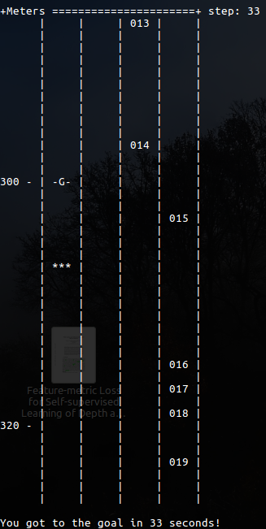

# Week 7 - Hybrid A* Algorithm & Trajectory Generation

------

### Implementation

- Assignment #1 (https://github.com/ShineySun/ 참조)
under the directory [./GNB](./GNB), you are given two Python modules:

* `prediction.py`: the main module you run. The `main()` function does two things: (1) read an input file ([`train.json`](./GNB/train.json)) and train the GNB (Gaussian Naive Bayes) classifier using the data stored in it, and (2) read another input file ([`test.json`](./GNB/test.json)) and make predictions for a number of data points. The accuracy measure is taken and displayed.
* `classifier.py`: main implementation of the GNB classifier. You shall implement two methods (`train()` and `precict()`), which are used to train the classifier and make predictions, respectively.

- 구현 내용 :
    1. train() : Collect the data and calculate mean and standard variation for each class. Record them for later use in prediction.
    ```python
    def train(self, X, Y):
        # TODO: implement code.
        val_with_lb = {}

        # val_with_lb['left'] = []
        # val_with_lb['keep'] = []
        # val_with_lb['right'] = []

        # for c in self.classes:
        #     for _ in range(4):
        #         val_with_lb[c].append([])

        # for x, y in zip(X, Y):
        #     x = self.process_vars(x)

        #     for idx, val in enumerate(x):
        #         val_with_lb[y][idx].append(val)
        
        for c in self.classes:
            val_with_lb[c] = np.empty((4, 0))

        for x, y in zip(X, Y):
            data = np.array(self.process_vars(x))
            val_with_lb[y] = np.append(val_with_lb[y], data, axis=1)
                
        means = {}
        stds = {}
        for c in self.classes:
            tmp = np.asarray(val_with_lb[c])
            means[c] = np.mean(tmp, axis=1)
            stds[c] = np.std(tmp, axis=1)
        
        self.means = means
        self.stds = stds
    ```
    - `self.classes` 를 이용하여 각 class `left,` `keep`, `right` 에 포함되어 있는 데이터의 mean, std를 구함
    - numpy, list 를 이용해 데이터를 모은 후 mean, std 함수를 사용해 mean, std를 각각 계산
       
    2. predict() : Calculate Gaussian probability for each variable based on the mean and standard deviation calculated in the training process. Multiply all the probabilities for variables, and 
                   then normalize them to get conditional probabilities. Return the label for the highest conditional probability.
    ```python
    def predict(self, observation):
        # TODO: implement code.
        probs = {}
        
        for c in self.classes:
            curr_prob = 1.0
            for i in range(len(observation)):
                curr_prob *= gaussian_prob(observation[i], self.means[c][i], self.stds[c][i])

            probs[c] = curr_prob

        highest_prob = 0.0
        highest_class = 'keep'

        for c in self.classes:
            if probs[c] > highest_prob:
                highest_prob = probs[c]
                highest_class = c

        return highest_class
    ```
    - `gaussian_prob` 함수를 이용해 observation 확률을 계산하여 multiply
    - `highest_prob`을 찾아 prediction

### 실행 결과


- Assignment #2
- Task 1
- 구현 내용 :
    - choose_next_state() : Implement the transition function code for the vehicle's behaviour planning finite state machine, which operates based on the cost function (defined in a separate module 
                            cost_functions.py).
    ```python
    def choose_next_state(self, predictions):
        # TODO: implement state transition function based on the cost
        #       associated with each transition.
        states = self.successor_states()

        minmum_cost = 9999
        optimal_traj = ''

        for i in range(len(states)):
            traj = self.generate_trajectory(states[i], predictions)
            cost = calculate_cost(self, traj, predictions)

            if cost < minmum_cost:
                minmum_cost = cost
                optimal_traj = traj

        # Note that the return value is a trajectory, where a trajectory
        # is a list of Vehicle objects with two elements.
        return optimal_traj
    ```
    - `states`, `predictions`로 trajectory 생성 후, cost 계산 및 최적 trajectory 출력
    - `states` 는 `successor_stats()` 를 통하여 획득
   
- Task 2
- 구현 내용 :
    1. goal_distance_cost() : Cost increases based on distance of intended lane (for planning a lane change) and final lane of a trajectory. Cost of being out of goal lane also becomes larger as vehicle approaches the goal distance.
    ```python
    def goal_distance_cost(vehicle, trajectory, predictions, data):
        distance = abs(data.end_distance_to_goal)
        if distance:
            cost = 1 - 2 * exp(-(abs(2.0 * vehicle.goal_lane - data.intended_lane - data.final_lane) / distance))
        else:
            cost = 1
        return cost
    ```
    - trajectory 와 intended lane의 최종 차선에 따라 cost 증가
    - `cost` 는 `vehicle.goal_lane`, `data.intended_lane`, `data.final_lane` 과 distance를 이용해 계산
       
    2. inefficiency_cost() : Cost becomes higher for trajectories with intended lane and final lane that have slower traffic.
    ```python
    def inefficiency_cost(vehicle, trajectory, predictions, data):
        intended_speed = velocity(predictions, data.intended_lane) or vehicle.target_speed
        final_speed = velocity(predictions, data.final_lane) or vehicle.target_speed

        cost = float(2.0 * vehicle.target_speed - intended_speed - final_speed) / vehicle.target_speed
        return cost
    ```
    - intended lane 과 느린 target lane 경우 cost 가 증가

### 실행 결과
- `REACH_GOAL = 0.5, EFFICIENCY = 0.5` -> Fail


- `REACH_GOAL = 0.8, EFFICIENCY = 0.2` -> Success


- `REACH_GOAL = 0.9, EFFICIENCY = 0.1` -> Success
