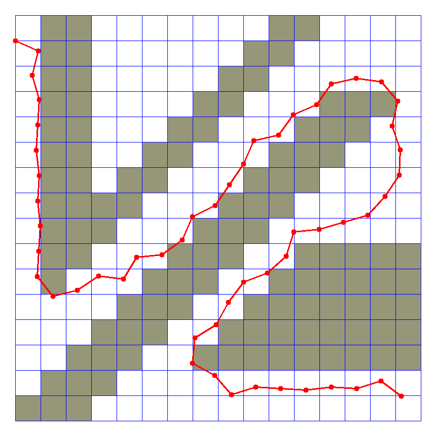

# Week 7 - Hybrid A* Algorithm & Trajectory Generation

------

### Implementation

You have to implement the following sections of code for the assignment:

* Trajectory generation: in the method `HybridAStar.expand()`, a simple one-point trajectory shall be generated based on a basic bicycle model. This is going to be used in expanding 3-D grid cells in the algorithm's search operation.
* Hybrid A* search algorithm: in the method `HybridAStar.search()`, after expanding the states reachable from the current configuration, the algorithm must process each state (i.e., determine the grid cell, check its validity, close the visited cell, and record the path. You will have to write code in the `for n in next_states:` loop.
* Discretization of heading: in the method `HybridAStar.theta_to_stack_num()`, you will write code to map the vehicle's orientation (theta) to a finite set of stack indices.
* Heuristic function: in the method `HybridAStar.heuristic()`, you define a heuristic function that will be used in determining the priority of grid cells to be expanded. For instance, the distance to the goal is a reasonable estimate of each cell's cost.

- 구현 내용 :   
- expand() implement
    1. implement the trajectory generation based on a simple bicycle model.
        ```python
        # Consider a discrete selection of steering angles.
        for delta_t in range(self.omega_min, self.omega_max, self.omega_step):
            # TODO: implement the trajectory generation based on
            # a simple bicycle model.
            # Let theta2 be the vehicle's heading (in radian)
            # between 0 and 2 * PI.
            # Check validity and then add to the next_states list.
            delta = np.pi / 180.0 * delta_t
            omega = self.speed / self.length * np.tan(delta)
            theta2 = theta + omega

            if (theta2 < 0): theta2 += 2 * np.pi

            x2 = x + self.speed * np.cos(theta)
            y2 = y + self.speed * np.sin(theta)

            state2 = {}
            state2['f'] = g2 + self.heuristic(x2, y2, goal)
            state2['g'] = g2
            state2['x'] = x2
            state2['y'] = y2
            state2['t'] = theta2
            next_states.append(state2)
        ```
        - bicyle model을 가정하여 현재 state 에서 가능한 다음 state 반환
        - `omega_min`부터 `omega_max`까지 `omega_step` 간격으로 나눈 각도
        - `theta2` 의 범위는 0 ~ 2 * PI
       
    2. implement prioritized breadth-first search for the hybrid A* algorithm.
        ```python
        # Compute reachable new states and process each of them.
        next_states = self.expand(curr, goal)
        for n in next_states:
            g2 = n['g']
            x2 = n['x']
            y2 = n['y']
            theta2 = n['t']

            if (x2 < 0 or x2 >= len(grid)) or (y2 < 0 or y2 >= len(grid[0])):
                continue
            
            stack2 = self.theta_to_stack_num(theta2)

            if self.closed[stack2][self.idx(x2)][self.idx(y2)] == 0 and \
                grid[self.idx(x2)][self.idx(y2)] == 0:
                opened.append(n)
                self.closed[stack2][self.idx(x2)][self.idx(y2)] = 1
                self.came_from[stack2][self.idx(x2)][self.idx(y2)] = curr
                total_closed += 1
        ```
        - `opened`를 sort
        - `expand()`를 이용해 다음 state 획득
        - 다음 state에 대해 갈 수 있는 맵 지점인지 확인
       
    3. implement a function that calculate the stack number given theta represented in radian.
        ```python
        theta2 = math.fmod((theta + 2 * np.pi), (2 * np.pi))
        stack_num = int((round(theta2 * self.NUM_THETA_CELLS / (2 * np.pi))) % self.NUM_THETA_CELLS)
        return stack_num
        ```
        - `theta`가 주어졌을 때 해당 stack의 수 반환
        - stack의 간격을 `NUM_THETA_CELLS`를 이용해 구함
       
    4. implement a heuristic function.
        ```python
        math.fabs(y - goal[0]) + math.fabs(x - goal[1])
        ```

### 실행 결과
- `speed = 1.0, NUM_THETA_CELLS = 90`
    